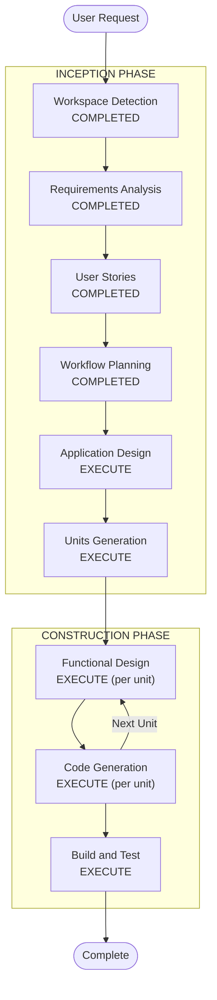

# Execution Plan — STR Analyzer

## Detailed Analysis Summary

### Change Impact Assessment
- **User-facing changes**: Yes — 8+ pages with complex multi-state workflows
- **Structural changes**: Yes — new full-stack application from scratch
- **Data model changes**: Yes — 9 tables + 2 lookups in PostgreSQL
- **API changes**: Yes — server actions + CSV export API route
- **NFR impact**: Yes — production-feel UI, performance for 500 txn processing

### Risk Assessment
- **Risk Level**: Medium (complex but well-specified via scaffold + requirements)
- **Rollback Complexity**: Easy (greenfield — can restart from any point)
- **Testing Complexity**: Moderate (rule engine logic, state transitions, OpenAI mocking)

---

## Workflow Visualization



### Text Alternative
```
INCEPTION PHASE:
  1. Workspace Detection     — COMPLETED
  2. Requirements Analysis   — COMPLETED
  3. User Stories            — COMPLETED
  4. Workflow Planning       — COMPLETED (current)
  5. Application Design     — EXECUTE
  6. Units Generation       — EXECUTE

CONSTRUCTION PHASE (per unit):
  7. Functional Design      — EXECUTE
  8. Code Generation        — EXECUTE
  9. Build and Test         — EXECUTE (after all units)
```

---

## Phases to Execute

### INCEPTION PHASE
- [x] Workspace Detection (COMPLETED)
- [x] Requirements Analysis (COMPLETED)
- [x] User Stories (COMPLETED)
- [x] Workflow Planning (COMPLETED)
- [ ] Application Design — **EXECUTE**
  - **Rationale**: New application needs component identification, service boundaries, and dependency mapping. The rule engine, alert workflow, case management, and OpenAI integration all need upfront design.
- [ ] Units Generation — **EXECUTE**
  - **Rationale**: System decomposes naturally into 4 units aligned with the 2-day workshop spec structure: data-and-seed, rule-engine, alert-review, str-register. Each unit is independently buildable.

### CONSTRUCTION PHASE
- [ ] Functional Design — **EXECUTE** (per unit)
  - **Rationale**: Each unit has business logic requiring detailed design (rule DSL→SQL translation, alert state machine, case auto-creation logic).
- [ ] NFR Requirements — **SKIP**
  - **Rationale**: Extensions all opted out. NFRs are documented in requirements.md and straightforward (production-feel UI, parameterized queries). No separate stage needed.
- [ ] NFR Design — **SKIP**
  - **Rationale**: No NFR Requirements stage = no NFR Design stage.
- [ ] Infrastructure Design — **SKIP**
  - **Rationale**: Infrastructure is a local PostgreSQL service + Next.js dev server. No cloud resource specification needed for workshop scope.
- [ ] Code Generation — **EXECUTE** (per unit, always)
  - **Rationale**: Implementation needed for all 4 units.
- [ ] Build and Test — **EXECUTE** (always)
  - **Rationale**: Build instructions and test verification for the complete system.

### OPERATIONS PHASE
- [ ] Operations — PLACEHOLDER (skip)

---

## Unit Decomposition (Preview)

| Unit | Scope | Day/Block | Key Deliverables |
|------|-------|-----------|-----------------|
| 1: data-and-seed | DB setup, `lib/db.ts`, migration, seed, transactions page | Day 1 AM | Working data layer + browse UI |
| 2: rule-engine | Rules CRUD, condition builder, `run-analyzer.ts`, OpenAI integration | Day 1 PM | Functional detection engine |
| 3: alert-review | Alert queue, detail page, approve/disapprove/dismiss, suspicious tab, cases | Day 2 AM | Complete review workflow |
| 4: str-register | STR tagging, register page, CSV export, dashboard, audit log | Day 2 PM | End-to-end filing + reporting |

---

## Estimated Timeline
- **Total Stages to Execute**: 8 (2 inception + 4×functional design + 4×code generation + 1 build/test)
- **Stages Skipped**: 4 (Reverse Engineering, NFR Requirements, NFR Design, Infrastructure Design)

## Success Criteria
- **Primary Goal**: Working STR Analyzer with production-feel UI that runs the full analyst journey
- **Key Deliverables**: All 23 user stories (17 Must, 3 Should, 2 Could) implemented
- **Quality Gates**: Idempotent seed, idempotent analyzer, all alert state transitions working, CSV export functional, OpenAI narratives generating
